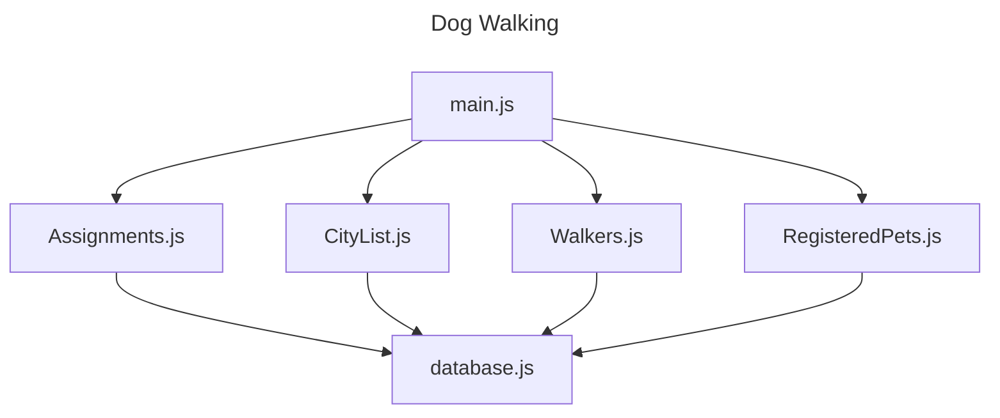

```mermaid
---
title: Dog Walking
---
flowchart TD
main["main.js"]
Assignments["Assignments.js"]
CityList["CityList.js"]
database["database.js"]
RegisteredPets["RegisteredPets.js"]
Walkers["Walkers.js"]
main-->Walkers
main-->CityList
main-->Assignments
main-->RegisteredPets
Assignments-->database
CityList-->database
Walkers-->database
RegisteredPets-->database
```