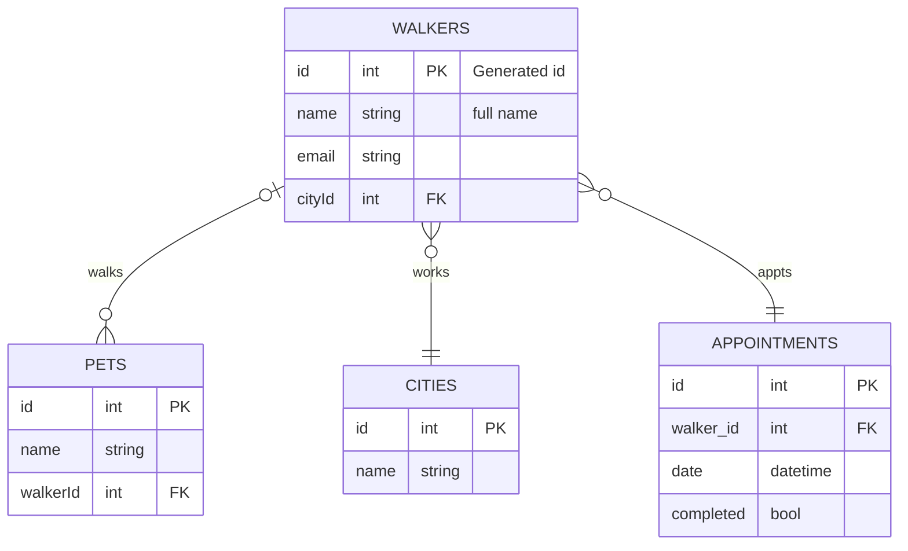

```mermaid
erDiagram
    WALKERS |o--o{ PETS : walks
    WALKERS }o--|| CITIES : works 
    WALKERS }o--|| APPOINTMENTS: appts
    
    WALKERS {
        id int PK "Generated id"
        name string "full name"
        email string
        cityId int FK
    }
    PETS {
        id int PK
        name string  
        walkerId int FK
    }
    CITIES {
        id int PK
        name string
    }
    APPOINTMENTS {
        id int PK
        walker_id int FK
        date datetime
        completed bool
    }
```